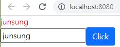
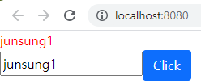
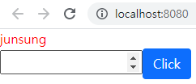
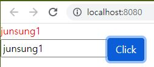
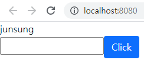
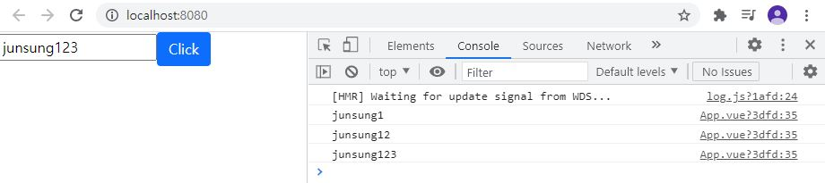
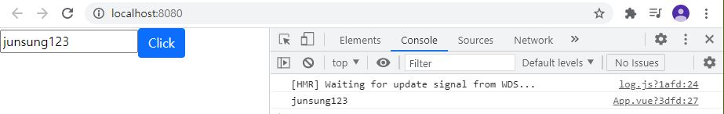
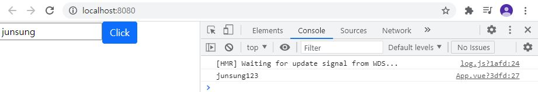

# vue3study

## vue3 설치

공식 사이트 : https://v3.vuejs.org/

 get started > installation

vue.js를 설치하는 방법은 주로 CDN(Content Delivery Network), npm(Node Package Manager), CLI(Command-Line Interface), Vite(프랑스어로 'fast'를 뜻함.) 중 하나를 사용하여 설치한다.

CLI를 이용하여 설치를 진행해보자.

선행 단계로 먼저 node.js부터 설치하자.

 	1. node.js 공식 사이트 : https://nodejs.org/ko/ 에서 LTS 버젼 다운로드
 	2. 터미널에서 `node -v` 을 통해 현재 설치된 node의 버젼을 확인.
 	 * 터미널은 ctrl + ` 으로 열 수 있다.(bash 터미널로 설정하자.)
 	   * 윈도우 VSCode 터미널에서 간혹 먹지않는 명령어들이 있는데 이를 해결하기 위해서는 기본터미널을 git bash로 바꿔주면 된다.
 	   * VSCode에서 터미널을 git bash 기본으로 설정하기 : https://mishka.kr/2019/06/24/vscode-gitbash/

3. node를 설치하면 npm(node package manager)이 같이 설치가 되므로 터미널에서`npm -v`  을 통해 npm 설치여부 및 버젼 확인.

4. 터미널에서 `npm install -g @vue/cli`을 통해 vue CLI를 설치.

5. 터미널에서 `vue -V` 또는 `vue --version` 을 통해 vue CLI 설치여부 및 버젼을 확인.

   * 여기서 본인은 command not found 에러메세지가 떴다.
   * 원인은 아마 path라는 환경변수에서 vue가 설치되어있는 경로가 없거나 잘못 지정되었기 때문이라고 생각했다.(vue 실행오류의 주범)
     * 환경변수란?
       * 프로세서가 컴퓨터에서 동작하는 방식에 영향을 미치는 동적인 값들의 모임이다.
       * 환경 변수 중 하나인 path변수는 운영체제가 어떤 프로세스를 실행시킬때, 그 경로를 찾는데 이용된다.
       * 따라서, 환경변수설정을 제대로 해주지 않으면 프레임워크가 제대로 동작하지 않을 수 있다.
   * 일단 환경변수를 추가하기 위해서는 vue가 설치된 경로를 알아야 하는데 99%확률로 다음과 같은 경로상에 있다.
     * C:\Users\사용자이름\AppData\Roaming\npm\node_modules\@vue\cli\bin
     * 여기서 본인은 경로를 따라가다가 AppData폴더가 안보였다.
       * 숨김폴더 보기 옵션을 이용하여 AppData폴더를 드러냈다.
     * 헤당 경로에 vue 파일이 존재하는지 확인한다.
   * vue 파일이 존재하는 경우 해당 경로를 복사해놨다가 환경변수에 추가해준다.
     * win10기준으로 시작 > 시스템 환경 변수 편집 > 고급 > 환경 변수 > 시스템 변수 에서 Path 변수 클릭 후 편집 버튼 클릭 > 새로 만들기 > vue 파일이 설치되어있는 경로 붙여넣기 후 확인.
   * 여기까지 한 후 혹시 몰라 터미널에서 `npm uninstall vue-cli-g` 을 통해 vue를 삭제하고 재설치 한 후 vscode를 한번 껏다가 켜서 버젼확인을 해보니 잘 되었다.

6. 프로젝트 생성

   * 터미널에서 `vue create 프로젝트명` 을 통해 프로젝트를 생성한다.
     * 여기서 vue2로 생성할지, vue3으로 생성할 지 묻는다. -> vue3 선택

7. 확장툴(extension tool)설치

   * vue.js를 코딩할 때 도움을 주는 확장툴을 설치한다

     * 필수 확장툴 : vetur(Pine Wu가 만든 패키지)

       * vetur 공식 깃허브 프로젝트 설정 : https://vuejs.github.io/vetur/guide/setup.html#project-setup 

       * `jsconfig.json` 또는 `tsconfig.json`이 있는 폴더경로에 `jsconfig.json`파일을 만들고 그 안에 아래와 같은 내용을 붙여넣기 해준다.

       * ```json
           {
             "include": [
               "./src/**/*"
             ]
           }
         ```


### 프로젝트 둘러보기

* `package.json`

  * `dependencies`, `devDependencies`
    * 필요한 패키지들을 리스트로 저장해놓는 공간
      * 패키지란? 쉽게 말하자면 남들이 만들어 놓은 부품이다.
      * 따라서 개발을 할 때 이 패키지들을 사용하기 위해서 `dependencies`와 `devDependencies`에 리스트로 저장해놓았다.
      * `dependencies` : 개발을 할때, production에 올릴때 필요한 패키지들을 담아놓은곳
      * `devDependencies` : 개발을 하는 동안에만 유용한 패키지들을 담아놓는 곳(나중에 production에 올릴때에는 이 패키지들은 필요하지 않다.). 또한 설치를 하게 되면 `node_modules` 안에 폴더형태로 설치가 된다.
        * Q: 그러면 왜 node_modules 안에 막상 들어가보면 패키지들이 수백개가 설치되어 있나요?
        * A: 하나의 패키지 안에서 내부적으로 사용하는 패키지들까지 같이 설치가 되기 때문입니다.

* `public`

  * `index.html`

    * vue프로젝트를 웹 브라우저에서 열었을 때 처음으로 받아오는 html파일.

    * 파일을 살펴보자.

    * ```html
      <!DOCTYPE html>
      <html lang="">
        <head>
          <meta charset="utf-8">
          <meta http-equiv="X-UA-Compatible" content="IE=edge">
          <meta name="viewport" content="width=device-width,initial-scale=1.0">
          <link rel="icon" href="<%= BASE_URL %>favicon.ico">
          <title><%= htmlWebpackPlugin.options.title %></title>
        </head>
        <body>
          <noscript>
            <strong>We're sorry but <%= htmlWebpackPlugin.options.title %> doesn't work properly without JavaScript enabled. Please enable it to continue.</strong>
          </noscript>
          <div id="app"></div>
          <!-- built files will be auto injected -->
        </body>
      </html>
      
      ```

    * 위의 코드를 보면 id="app"인 div 태그가 하나 있는데 이 태그안에서 vue application이 전부 구동이 된다.

    * 나중에 build를 하게 되면 div태그 밑줄에 자바스크립트 script가 자동으로 들어가게된다.

      * 자바스크립트 script가 들어가게 되면 src(source) 폴더 내에 있는 main.js가 가장먼저 실행된다.

      * main.js 를 살펴보면

        * ```js
          // vue에서 createApp 함수를 가져와서
          import { createApp } from 'vue'
          import App from './App.vue'
          // vue3가 되면서 기존의 Vue 생성자 함수를 사용하는 대신에, createApp() 함수를 사용한다.
          // 최상위 컴포넌트(App)를 createApp 함수에 넣어주고
          // App 컴포넌트의 컨텐츠를 id가 app인 div태그안에 넣는다.
          createApp(App).mount('#app')
          
          ```

      * 그렇다면 App.vue 컴포넌트 안에는 어떤 컨텐츠들이 있는지 살짝 살펴보자.

        ```vue
        <template>
          <!-- 이미지 태그가 있다. -->
          
          <!-- 3. HelloWorld 태그에서 메세지를 띄운다. -->
          <HelloWorld msg="Welcome to Your Vue.js App"/>
        </template>
        
        <script>
        // 1. HelloWorld.vue로부터 HelloWorld를 불러와서
        import HelloWorld from './components/HelloWorld.vue'
        
        export default {
          // 2. 이름이 App인 컴포넌트에 HelloWorld 컴포넌트를 등록한다.
          name: 'App',
          components: {
            HelloWorld
          }
        }
        </script>
        
        <style>
        #app {
          font-family: Avenir, Helvetica, Arial, sans-serif;
          -webkit-font-smoothing: antialiased;
          -moz-osx-font-smoothing: grayscale;
          text-align: center;
          color: #2c3e50;
          margin-top: 60px;
        }
        </style>
        ```

        * image 태그가 id가 App인 div 태그안에 잘 들어갔는지 웹 브라우저에서 확인해보자.

          * package.json파일을 살펴보면 다음과 같은 코드가 있을 것이다.

            ```json
              "scripts": {
                "serve": "vue-cli-service serve",
                "build": "vue-cli-service build",
                "lint": "vue-cli-service lint"
              },
            ```
            
            이 말인 즉슨, 개발서버를 실행시키기 위해서는 "serve"를 사용해야 한다는 것이다.
            
            터미널에서 `npm run serve` 명령어로 개발서버를 실행시킬수 있다.
            
            (build는 production에 올리기 전에 production에 올리기에 최적화 된 파일을 만드는 과정이다.)
        
      * App.vue 컴포넌트 내의 코드를 다 지우고 다음과 같이 작성한 후 서버를 실행시켜보자.
      
        ```vue
        <template>
          <div>username</div>
        </template>
        ```
      
        웹 브라우저에서 F12를 눌러 개발자 도구를 활성화 한 다음 Elements를 보면 id가 app인 div태그 내에 내가 작성한 div태그가 들어가있는 모습을 볼 수 있다.
    
    

### vue component란?

* 이름에서도 알 수 있듯이 하나의 부품(component)이다.
* component파일을 만들면 확장자가 vue가 된다.

#### vue component구성

* vue component는 세 부분으로 나눠진다.
  1. template
     * html 코드가 들어간다.
  2. script
     * 자바스크립트 로직이 들어간다
  3. style
     * CSS 코드가 들어간다

* script에 선언 후 template에서 사용해보자.(composition API를 사용할 것이다.)(+ CSS 스타일링 포함)

  * composition API란?

    * 구성 요소 논리를 유연하게 구성할 수 있는 추가 기능 기반 API이며, Vue 3.0 에서 새로 추가된 함수 기반의 API이다.
    * 기존에 사용하던 Options API를 사용해서 논리구조를 분리하고 재사용을 가능하도록 하는 것을 목적으로 만들어졌다.
    * 기존에도 mixin 기능을 활용하면 코드를 재사용 할 수 있었지만, 오버라이딩 문제나 여러가지 mixin을 상속받을 경우 컴포넌트를 관리하기가 조금 까다로워지는 등 아쉬움이 있어 이러한 단점을 보완하기 위해 Composition API를 사용한다.
    * setup 훅(hook) 이란?
      * composition API를 사용하기 위한 진입점 즉, 초기화 지점이다.
    
    ```vue
    <template>
      <!-- 1-4. template내에서 변수에 접근하려면 다음과 같은 방식으로 접근해야 한다. -->
      <!-- {{ 변수명 }} -->
      <!-- 2. style 안에 CSS 코드를 넣어서 글자색을 red로 바꿔보자. -->
      <!-- 2-1. div 태그에 클래스명을 설정해주고 -->
      <div class="name">{{ name }}</div>
    </template>
    
    <script>
    // 1. composition API 사용
    // 1-1 export default 내에 setup 훅(hook)을 만들고 그 안에서 필요한 로직을 작성
    export default {
      setup() {
        // 1-2. 변수 등록
        const name = "Junsung";
        // setup 함수 내에서 object를 return한다.
        // 1-3. 사용하고자 하는 변수를 return해주면 template내에서 변수에 접근이 가능해진다.
        return {
          name
        };
      }
    }
    </script>
    
    <style>
    /* 2-2. '.클래스명{}' 으로 클래스를 호출해주고 색상 설정. */
    /* 웹 브라우저에서 클래스명이 name인 div 태그안의 내용들의 색상이 빨간색으로 변경된 것을 확인할 수 있다. */
      .name {
        color: red;
      }
    </style>
    ```


### Vue 3 Fragments

* Vue 3에서 컴포넌트는 다중 루트 노드(multi-root nodes) 컴포넌트인 fragments를 공식 지원한다.
  * 링크 : https://v3.ko.vuejs.org/guide/migration/fragments.html#_2-x-%E1%84%80%E1%85%AE%E1%84%86%E1%85%AE%E1%86%AB
* 결론 : template 내에서 여러개의 컴포넌트들을 하나의 단일 div 태그로 감싸지 않아도 됨.


### Composition API에서의 함수 정의 및 사용

'Hello'문자열을 반환하는 greeting이라는 함수를 한번 만들어보자

* 기본

  ```vue
  <template>
    <div class="name">
      <!-- 2. greeting이라는 함수를 통해 'Hello'라는 문자열 넣어보기 -->
      <!-- 함수로 접근을 할 때에는 함수명 뒤에 ()를 적어줘야 한다. -->
      {{ greeting() }}
    </div>
  </template>
  
  <script>
  export default {
    setup() {
      const name = "Junsung";
      // 1. 함수 정의하기
      // 1-1. setup 훅(hook) 내에 greeting이라는 이름의 화살표 함수를 만든다.
      const greeting = () => {
        // 1-2. greeting 함수에서 'Hello'라는 값을 return해준다.
        return 'Hello';
      }
      return {
        name,
        // 1-3. setup 훅 내에서 greeting 함수를 return해줌으로써 template에 접근할 수 있게 된다.
        greeting,
      };
    }
  }
  </script>
  
  <style>
    .name {
      color: red;
    }
  </style>
  ```

  

  서버를 실행시켜보면 다음과 같이 Hello를 출력하고 있음을 확인할 수 있다.


* 함수에서 매개변수를 받아서 그 매개변수를 함수안에서 사용할 수도 있다.

  ```vue
  <template>
    <div class="name">
      <!-- 인자==값 -->
      <!-- 1-4. 인자(name)를 함수로 넘겨준다. -->
      {{ greeting(name) }}
    </div>
  </template>
  
  <script>
  export default {
    setup() {
      const name = "Junsung";
      // 1. 함수에서 매개변수를 받아서 그 매개변수를 함수안에서 사용할 수 있다.
      // 1-1. greeting에서 name이라는 매개변수를 받는다.
      const greeting = (name) => {
        // 1-2. greeting 함수에서 'Hello, ' + 변수name을 return해준다.
        return 'Hello, ' + name;
      }
      return {
        name,
        // 1-3. setup 함수에서 greeting 함수를 return해줌으로써 template에 접근할 수 있게 된다.
        greeting,
      };
    }
  }
  </script>
  
  <style>
    .name {
      color: red;
    }
  </style>
  ```

  서버를 실행시켜보면 다음과 같이 Hello Junsung을 출력하고 있음을 확인할 수 있다.

  

* 정의된 함수를 변수에 저장해서 사용할 수도 있다.

  ```vue
  <template>
    <div class="name">
      {{ greet }}
    </div>
  </template>
  
  <script>
  export default {
    setup() {
      const name = "Junsung";
  
      const greeting = (name) => {
        return 'Hello, ' + name;
      };
  
      const greet = greeting(name);
      return {
        greet,
      };
    }
  }
  </script>
  
  <style>
    .name {
      color: red;
    }
  </style>
  ```


### event

* `v-on`디렉티브를 사용하여 DOM(Document Object Model) 이벤트를 듣고 트리거 될 때 JavaScript를 실행할 수 있다.
  
  * `v-on:`은  약어로 `@`이다.
  
* ex1) 버튼을 클릭 시 브라우저 콘솔창에 'hello world'를 출력하는 이벤트를 만들어보자.

  ```vue
  <template>
    <!-- 버튼의스타일을 꾸미기 위해 bootstrap CDN을 설치하였다. -->
    <!-- 1. 버튼추가 -->
    <!-- 1-1. button 태그의 속성을 v-on 디렉티브로 정해주고 click이벤트를 걸어준다.  -->
    <!-- 1-4. click이벤트시 실행할 함수로 return 된 consoleLog 함수를 걸어준다. -->
    <button
      class="btn btn-primary"
      @click="consoleLog"
    >
      Click
    </button>
  </template>
  
  <script>
  export default {
    setup() {
      
      // 1-2. 브라우저 콘솔창에 'hello world'를 출력하는 함수작성
      const consoleLog = () => {
        console.log('hello world');
      };
  
      // 1-3. consoleLog 함수 return
      return {
        consoleLog,
      };
    }
  }
  </script>
  
  <style>
    .name {
      color: red;
    }
  </style>
  ```

  다음과 같이 버튼을 클릭시 브라우저 콘솔창에서 'hello world'가 성공적으로 출력됨을 확인할 수 있다.

  

* ex2) 버튼을 클릭 시 브라우저에서 출력되고있는 'hell world'를 'hello world'로 바꿔보자.

  ```vue
  <template>
    <div class="name">
      {{ name }}
    </div>
    <!-- 1-3. 클릭이벤트에 updateName함수를 실행하도록 하였다. -->
    <button
      class="btn btn-primary"
      @click="updateName"
    >
      Click
    </button>
  </template>
  
  <script>
  export default {
    setup() {
      // 1. 변수에 할당된 값을 변경해야 하므로 재할당이 가능한 변수선언방식인 let을 사용한다.
      let name = 'hell world'
      
      // 1-1. name변수에 할당된 값을 'hello world'로 재할당 시켜주는 updateName함수 작성
      // 콘솔창에서 변경점을 확인할 수 있도록 한다.
      const updateName = () => {
        name = 'hello world';
        console.log(name)
      };
  
      // 1-2. updateName함수 return
      return {
        name,
        updateName,
      };
    }
  }
  </script>
  
  <style>
    .name {
      color: red;
    }
  </style>
  ```

  다음과 같이 버튼을 클릭 시 브라우저 콘솔창에서만 'hello world'가 뜨고 브라우저에서는 'hell world'가 뜨는것으로 미루어보아 클릭이벤트는 제대로 작동하여 name에 할당된 값은 바뀌었지만 template에는 적용되지 않은것을 확인할 수 있다.

  


### ref

* vue.js composition API를 사용하면 일반 변수를 사용하여 template에 나타내고 있는 값은 나중에 재할당 하여도 template에 적용되지 않는다(변수에는 적용됨).

* 따라서 vue.js에서는 변수값을 재할당 하였을 시 template에도 적용이 되도록하는 ref 기능을 제공한다.

  * 단, 일반 변수에 값을 담으면 안되고 ref를 사용하여 변수에 값을 담아줘야 template에 적용된다.

* 기존 뷰 버전에서는 `ref`가 뷰 템플릿의 DOM 또는 컴포넌트를 가리키는 속성으로 사용되었으나, Vue 3 에서는 `ref`가 `reactive reference`를 의미한다.

  ```vue
  <template>
    <div class="name">
      {{ name }}
    </div>
    <!-- 1-4. click 이벤트 시 updateName함수가 실행되도록 한다. -->
    <button
      class="btn btn-primary"
      @click="updateName"
    >
      Click
    </button>
  </template>
  
  <script>
  // 1. vue 패키지에서 ref를 불러온다.
  import { ref } from 'vue';
  
  export default {
    setup() {
      // 1-1. 재할당이 불가능한 const 변수선언으로 name을 선언하고 값을 ref안에 담아준다.
      const name = ref('hell world')
      
  
      const updateName = () => {
        // 1-2. 변수 선언 시 ref를 사용했다면 변수 값을 재할당 시 .value로 변수값에 접근해야 한다.
        // updateName 함수가 실행되면 'hello world'가 name.value에 업데이트 되면서 template에도 같이 업데이트가 된다.
        // 이렇게 data가 변경이 될 시 template에도 같이 data가 변경이 되는것을 'reactive하다' 라고 한다.
        // 문자열, 숫자형 같은 기본 자료형은 반드시 ref를 사용해야 reactive하게 사용할 수 있다.
        // ref 안에는 기본자료형 뿐만 아니라, 오브젝트, 배열도 사용할 수 있다.
        // reactive를 사용하면 오브젝트, 배열에 한해서 .value를 사용하지 않고 변수값에 접근할 수 있다.
        name.value = 'hello world';
        console.log(name)
      };
  
      // 1-3. updateName함수 return
      return {
        name,
        updateName,
      };
    }
  }
  </script>
  
  <style>
    .name {
      color: red;
    }
  </style>
  ```

  다음과 같이 버튼을 클릭시 브라우저에서 'hell world'가 'hello world'로 성공적으로 변경됨을 확인할 수 있다.

  

* ref를 사용해서 오브젝트, 또는 배열에 접근하기

  ```vue
  <template>
    <div class="name">
      {{ name }}
    </div>
    <!-- 1-4. click 이벤트 시 updateName함수가 실행되도록 한다. -->
    <button
      class="btn btn-primary"
      @click="updateName"
    >
      Click
    </button>
  </template>
  
  <script>
  // 1. vue 패키지에서 reactive를 불러온다.
  import { ref } from 'vue';
  
  export default {
    setup() {
      // 1-1. 재할당이 불가능한 const 변수선언으로 name을 선언하고 오브젝트를 reactive안에 담아준다.
      const name = ref({
        id: 1
      })
      
      // 1-2. .value.id로 ref를 사용하고도 오브젝트에 접근이 가능하다.
      const updateName = () => {
        name.value.id = 2;
        console.log(name)
      };
  
      // 1-3. updateName함수 return
      return {
        name,
        updateName,
      };
    }
  }
  </script>
  
  <style>
    .name {
      color: red;
    }
  </style>
  ```

  


### reactive

* reactive를 사용하면 오브젝트, 배열에 한해서 .value를 사용하지 않고 변수값에 접근할 수 있다.

  ```vue
  <template>
    <div class="name">
      {{ name }}
    </div>
    <!-- 1-4. click 이벤트 시 updateName함수가 실행되도록 한다. -->
    <button
      class="btn btn-primary"
      @click="updateName"
    >
      Click
    </button>
  </template>
  
  <script>
  // 1. vue 패키지에서 reactive를 불러온다.
  import { reactive } from 'vue';
  
  export default {
    setup() {
      // 1-1. 재할당이 불가능한 const 변수선언으로 name을 선언하고 오브젝트를 reactive안에 담아준다.
      const name = reactive({
        id: 1
      })
      
      // 1-2. .value 대신 .id로 오브젝트에 바로 접근이 가능하다.
      const updateName = () => {
        name.id = 2;
        console.log(name)
      };
  
      // 1-3. updateName함수 return
      return {
        name,
        updateName,
      };
    }
  }
  </script>
  
  <style>
    .name {
      color: red;
    }
  </style>
  ```

  다음과 같이 버튼을 클릭 시 id 값이 바뀌는 것을 확인할 수 있다.

  

  

### reactive vs ref

링크: https://joshua1988.github.io/vue-camp/vue3.html#reactive%EA%B0%80-%EB%8D%94-%EC%84%A0%EC%96%B8%ED%95%98%EA%B8%B0-%ED%8E%B8%ED%95%9C-%EA%B2%83-%EA%B0%99%EC%9D%80%EB%8D%B0%EC%9A%94


### 데이터 바인딩(Data binding)

* 공식문서 : https://kr.vuejs.org/v2/guide/forms.html

* 데이터 바인딩 이란 두 데이터 혹은 정보의 소스를 모두 일치시키는 기법이다.
* 화면에 보이는 데이터와 브라우저 메모리에 있는 데이터를 일치시키는 기법이다.
* `v-bind:`은  약어로 `:`이다.

ex1) 변수 name에 할당된 값을 input 박스 안의 값과 바인딩시켜보자.

```vue
<template>
  <div class="name">
    {{ name }}
  </div>
  <!-- vue.js 에더 data를 input값과 바인딩 하는 방법: v-bind:value="변수명"  -->
  <input type="text" :value="name">
  <button
    class="btn btn-primary"
    @click="updateName"
  >
    Click
  </button>
</template>

<script>

import { ref } from 'vue';

export default {
  setup() {
    const name = ref('junsung')
    
    const updateName = () => {
      name.value = 'junsung1';
      console.log(name)
    };

    return {
      name,
      updateName,
    };
  }
}
</script>

<style>
  .name {
    color: red;
  }
</style>
```

다음과 같이 변수 name에 할당된 값이 input 박스와 바인딩 되어 있는 것을 확인 할 수 있다.



그리고 버튼을 클릭 시 updateName함수에 의해 변수 name에 'junsung1'이라는 값이 재할당 되었고 함수 updateName과 변수 name 둘 다 setup 훅 내에서 return되었기 때문에 template 내에서 접근할 수 있게 되었다. 따라서 template 내에 있는 input 박스에 바인딩 된 값도 같이 바뀐것을 확인할 수 있다.



* 바인딩은 value속성뿐만 아니라, 모든속성에 사용가능하다.

  ```vue
  <template>
    <div class="name">
      {{ name }}
    </div>
    <!-- 1-3. type속성을 변수 tmp1과 바인딩 시켰다. -->
    <input :type="tmp1" :value="name">
    <button
      class="btn btn-primary"
      @click="updateName"
    >
      Click
    </button>
  </template>
  
  <script>
  
  import { ref } from 'vue';
  
  export default {
    setup() {
      const name = ref('junsung')
      // 1. 새 변수 tmp1을 선언하고 'number'를 할당시켰다.
      const tmp1 = ref('number')
      
      const updateName = () => {
        name.value = 'junsung1';
        // 1-1. 함수 updateName이 실행되면 변수 tmp1에 할당된 값이 'text'로 바뀐다.
        tmp1.value = 'text'
      };
      
      // 1-2. 변수, 또는 함수를 사용하게 된다면 template 내에서 접근할 수 있도록 return 해주어야 함.
      return {
        name,
        tmp1,
        updateName,
      };
    }
  }
  </script>
  
  <style>
    .name {
      color: red;
    }
  </style>
  ```

  서버를 실행시켜보면 초기에 변수 name에 할당되어있는 값은 junsung이고 input 박스의 type속성은(tmp1과 바인딩 되어있고 변수 tmp1이 가지고 있는 값은 'number'이기 때문에) 'number'가 된다. 

  

  그리고 버튼을 클릭 시 updateName함수에 의해 변수 name에 'junsung1'이라는 값이 재할당 되었고 변수 tmp1의 값이 'text'로 재할당 되었다.

  변수 tmp1은 template 내의 input 박스의 type 속성과 바인딩 되어있기 때문에 input 박스의 type속성이 'number'에서 'text'로 변경되었다. 그리고 이에 따라 변수 name에 할당된 값도 input 박스에 보여지게 되었다.

  

  

* 클래스에도 바인딩을 할 수 있다.

  ```vue
  <template>
    <!-- 1-3. class와 바인딩 -->
    <div :class="nameClass">
      {{ name }}
    </div>
  
    <input :type="tmp1" :value="name">
    <button
      class="btn btn-primary"
      @click="updateName"
    >
      Click
    </button>
  </template>
  
  <script>
  
  import { ref } from 'vue';
  
  export default {
    setup() {
      const name = ref('junsung')
      const tmp1 = ref('number')
      // 1. class 바인딩 하기
      // 1-1. class와 바인딩 할 변수 nameClass 선언
      const nameClass = ref('name')
      
      const updateName = () => {
        name.value = 'junsung1';
        tmp1.value = 'text'
      };
      // 1-2. 변수 nameClass return
      return {
        name,
        tmp1,
        updateName,
        nameClass,
      };
    }
  }
  </script>
  
  <style>
    /* 'name'값을 가지고 있는 변수 nameClass가 클래스에 바인딩이 되어있기 때문에 결국 클래스명은 'name'이 된다. 따라서 해당 클래스에 스타일링을 할 때에는 클래스 명을 name으로 호출해야 한다. */
    .name {
      color: red;
    }
  </style>
  ```

  변수 nameClass에 할당된 값을 'name'이 아닌 다른 값으로 변경하게 된다면 클래스명을 'name'으로 호출하고 있는 스타일링이 적용되지 않는다.

  ​	ex) const nameClass = ref('aaa')

  


### 양방향 바인딩

* 양방향 바인딩에 대해 제대로 이해하려면 다음과 같은 내용에 대해 이해하고 있는것이 좋다.
  * 프로퍼티 바인딩 : https://angular.kr/guide/property-binding
  * 이벤트 바인딩 : https://angular.kr/guide/event-binding
  * 입출력 프로퍼티 : https://angular.kr/guide/inputs-outputs
* 양방향 바인딩은 프로퍼티 바인딩과 이벤트 바인딩이 결합된 것이다.
  * 엘리먼트 프로퍼티의 값을 지정하기 위해 프로퍼티 바인딩이 사용된다.
  * 엘리먼트가 변경된 것을 감지하기 위해 이벤트 바인딩이 사용된다.

* 한마디로 요약하자면, `Vue 인스턴스` **⇄** `Template` 과 같이 두 방향 모두 데이터에 접근 할 수 있도록 하는 것을 양방향 데이터 바인딩 이라고 한다.

* vue.js에서 양방향 데이터 바인딩을 가능하게 해주는 디렉티브가 바로 `v-model` 이다.

* 만약 `v-model`을 사용하지 않으면!!!!! 이렇게나 어렵게 양방향 바인딩을 해야한다... ㅠㅠ

  ```vue
  <template>
    <!-- javascript Event 중에 oninput이라는 이벤트가 있다. -->
    <!-- @input="updateName" : 사용자가 input 박스에 값을 입력 시 oninput이벤트를 실행하여 "updateName" 함수 실행 -->
    <input 
      type="text"
      :value="name"
      @input="updateName"
    >
    <!-- javascript Event 중에 onclick이라는 이벤트가 있다. -->
    <!-- @click="onSubmit" : 클릭 감지 시 onclick이벤트를 실행하여 "onSubmit" 함수 실행 -->
    <button
      class="btn btn-primary"
      @click="onSubmit"
    >
      Click
    </button>
  </template>
  
  <script>
  import { ref } from 'vue';
  
  export default {
    setup() {
      const name = ref('junsung')
      // 함수 onSubmit 실행 시 브라우저 콘솔창에 name에 할당된 값을 출력
      const onSubmit = () => {
        console.log(name.value)
      };
  
      // 함수 updateName 실행 시 input 박스에 대한 정보들을 가지고 있는 e(event)라는 객체를 받아온다.
      const updateName = (e) => {
        // event라는 객체를 브라우저 콘솔창에 출력해보면 input Event 객체가 브라우저 콘솔창에 출력된다..
        // console.log(e)
        // e.target.value 과 같은 방식으로 해당 input Event객체에 있는 value에 접근이 가능하다.
        console.log(e.target.value)
      };
  
      return {
        name,
        onSubmit,
        updateName,
      };
    }
  }
  </script>
  
  <style>
    .name {
      color: red;
    }
  </style>
  ```

  서버를 실행시켜 'junsung'값을 기본으로 가지고 있던 input 박스에 추가로 1,2,3을 차례대로 작성해보았더니 매 번 값이 바뀔때마다 성공적으로 해당 값을 브라우저 콘솔창에 출력하는 모습을 확인할 수 있었다.

  

  다음과 같이 input Event 객체에 있는 value를 name에 재할당만 시켜놓으면 click시 최종적으로 input 박스에 있는 값을 브라우저 콘솔창에 출력시킬수도 있다.

  

* `v-model`을 사용해보자.

  ```vue
  <template>
    <!-- 다음과 같이 v-model="name" 작성을 통해 쉽고 간편하게 양방향 바인딩이 가능하다. -->
    <input 
      type="text"
      v-model="name"
    >
  
    <button
      class="btn btn-primary"
      @click="onSubmit"
    >
      Click
    </button>
  </template>
  
  <script>
  import { ref } from 'vue';
  
  export default {
    setup() {
      const name = ref('junsung')
      // 함수 onSubmit 실행 시 브라우저 콘솔창에 name에 할당된 값을 출력
      const onSubmit = () => {
        console.log(name.value)
      };
  
      return {
        name,
        onSubmit,
      };
    }
  }
  </script>
  
  <style>
    .name {
      color: red;
    }
  </style>
  ```

  다음과 같이 `v-model`을 사용함으로써 value 바인딩을 해주고 script의 변수에 저장된 값까지 같이 업데이트 해줌을 알 수 있다.

  


### 다음에 할 것: ???
